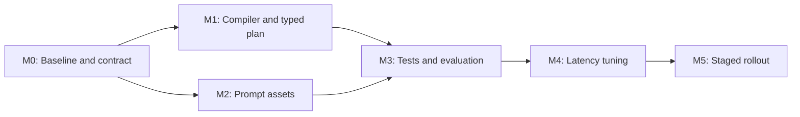

# API-Only Prompt Composition Development Plan

**Status:** In progress (M1-M2 complete; M3 live evaluation running)  
**Scope:** Server-side prompt compilation, prompt assets, evaluation, and API rollout  
**Related roadmap stage:** V2 Stage 6.4, Versioned prompt plans and enhancer  
**Estimated effort:** 8 focused engineering days  
**Estimated calendar duration:** 8-10 business days with QA/review overlap  
**Client impact:** None. No macOS binary, API request schema, user setting, or user reconfiguration change.

## 1. Objective

Improve how WriterFlow uses the context already supplied by installed Mac clients and
make each writing action behaviorally distinct, with particular emphasis on Prompt
Builder and Reply/platform formatting.

The implementation must:

- compile all prompt policy on the WriterFlow API;
- use only fields already present in the inference request envelope;
- preserve the current explicit-action privacy boundary;
- make Prompt Builder produce instructions for another AI, never the underlying answer;
- make Reply participate naturally in the current conversation rather than paraphrase
  the user's rough intent;
- give email, chat, LinkedIn, LLM-chat, coding-chat, and unknown destinations visibly
  different output contracts;
- keep deterministic actions to one provider call;
- preserve streaming, output-mode, replacement, and client parser compatibility; and
- meet the latency and quality gates in this plan before production rollout.

## 2. Scope boundaries and assumptions

### In scope

- `services/api/src/inference/promptCompiler.ts` and supporting server-only prompt-plan
  types/helpers.
- `prompts/manifest.yaml`, `prompts/intents/*.md`, and `prompts/common/**/*.md`.
- Server unit, contract, injection, evaluation, and latency tests.
- Prompt-version telemetry using the existing metadata-only logging policy.
- API container build, staged rollout, verification, and rollback.

### Out of scope

- Changes to the macOS Accessibility tree walk, context collection heuristics, or 4,000
  character local extraction cap.
- New request fields, API schema changes, or client parsing changes.
- New UI, action names, settings, feature flags, or user configuration.
- Passive context upload, automatic inference, or removal of the action menu.
- A mandatory second model call, classifier, model migration, or multi-model router.
- Personalization uploads or changes to local history/memory behavior.

### Planning assumptions

- One backend/prompt engineer is available full time, with part-time Product/Prompt QA,
  Security, and Release Operations review. A single person may hold multiple roles.
- Role owners below are accountable placeholders; named individuals are assigned at
  kickoff without changing scope or estimates.
- The agreed response-generation contract is:
  - target first visible delta in 1-2 seconds;
  - p95 first visible delta no greater than 2.5 seconds through APIM on a warm service;
  - the existing server first-delta abort remains 3 seconds;
  - the existing client watchdog remains 4 seconds; and
  - a 100-word rewrite should complete within 2.5 seconds under the PRD reference case.
- Existing context caps remain 1,200 characters for rewrite actions, 2,000 for Custom,
  and 4,000 for Reply and Prompt Builder.

If the latency contract above is not the intended meaning of "agreed response-generation
timeframe," this plan must be re-estimated before implementation.

## 3. Owners

| Code | Named owner | Owner role | Accountability |
|---|---|---|---|
| BE | Karan Modi | Backend and Prompt Engineer | Compiler, prompt assets, tests, benchmarks, API image |
| PQ | Karan Modi | Product and Prompt Quality Reviewer | Action definitions, rubric, pairwise review, sign-off |
| QA | Karan Modi | QA and Evaluation Owner | Corpus, regression harness, platform matrix, evidence |
| SEC | Karan Modi | Security and Privacy Reviewer | Trust classes, injection tests, redaction/log review |
| SRE | Karan Modi | Release Operations | Staging/canary rollout, monitoring, rollback readiness |
| PO | Karan Modi | Product Owner | Final scope, quality, and production go/no-go approval |

This is a solo-project accountability assignment. Codex performs implementation and
verification work under the named owner's direction but is not recorded as a human
reviewer or accountable release owner.

## 4. Latency and quality budgets

Prompt work must improve behavior without lengthening the critical path unnecessarily.

| Budget | Target | Hard gate |
|---|---:|---:|
| Warm prompt compilation p95 | <= 5 ms | <= 10 ms |
| Total request-to-first-visible-delta p50 | <= 1.5 s | <= 2.0 s |
| Total request-to-first-visible-delta p95 | <= 2.5 s | < 3.0 s server abort |
| 100-word rewrite completion | <= 2.5 s | No regression greater than 10% versus baseline |
| Provider calls per normal action | 1 | Exactly 1 |
| Rewrite system-policy size | <= 900 tokens | <= 1,100 tokens |
| Reply/Prompt Builder system-policy size | <= 1,400 tokens | <= 1,600 tokens |
| Existing context budgets | Unchanged | Must not increase |

Speed rules:

- Load and validate prompt assets once at API startup; do not synchronously read Markdown
  files for every inference request.
- Select prompt variants through closed server mappings, never through model inference.
- Do not add a separate prompt-enhancement call. Prompt Builder output is the final
  preview for that action.
- Preserve the current per-action completion-token ceilings unless benchmarks justify a
  lower ceiling without truncation.
- Run quality evaluation before performance tuning so shorter prompts are not accepted
  merely because they are faster.

## 5. Target prompt contracts

### 5.1 Source and context normalization

The compiler will derive one canonical source without changing the request contract:

```text
if targetScope == "selection" and selectedText is non-empty:
    SOURCE = selectedText
else:
    SOURCE = draft
```

`CONVERSATION` remains untrusted background data. The action controls how it may be used:

| Action | Conversation role |
|---|---|
| Elaborate | Resolve references and preserve terminology; may support clearer explanation but not introduce new facts |
| Formal | Resolve references and protect facts; must not add thread content to the draft |
| Casual | Resolve references and protect facts; must not add thread content to the draft |
| Fix Grammar | Protect names, paths, identifiers, and intentional terminology only |
| Custom | Interpret ambiguous instructions only; explicit `INSTRUCTION` remains authoritative |
| Reply | Primary factual and interpersonal context for the next message |
| Prompt Builder | Prior AI-thread context for continuation mode; background input for a self-contained fresh prompt |

### 5.2 Per-action differentiation

| Action | Tone | Structure | Required existing fields | Output contract |
|---|---|---|---|---|
| Elaborate | Clear developmental editor; same voice/register as source | Preserve lead and outcome; add necessary explanation, transitions, and organization | `SOURCE`; optional `CONVERSATION` | Expanded source only; no greeting or invented requirement |
| Formal | Precise, professional, restrained | Preserve content/order; improve diction, grammar, and sentence completeness | `SOURCE`; optional `appTone`, `CONVERSATION` | Formal rewrite only; no new apology, commitment, greeting, or corporate filler |
| Casual | Relaxed, concise, natural | Shorter phrasing and contractions where natural; preserve every ask and constraint | `SOURCE`; optional `appTone`, `CONVERSATION` | Casual rewrite only; no invented emoji, slang, or small talk |
| Fix Grammar | Conservative copy editor | Preserve clauses, vocabulary, rhythm, and formatting; change only demonstrable errors | `SOURCE`; optional `CONVERSATION` for terminology | Corrected source, or byte-equivalent source when already correct |
| Custom | Literal specification executor | Apply explicit format/length/include/exclude constraints before default rewriting behavior | `INSTRUCTION`, `SOURCE`; optional `CONVERSATION` | Result only; no legacy `---INSERT---` marker in cloud deltas |
| Reply | Context-aware conversation participant | Address latest relevant message, express user intent, include only necessary specifics, close for medium | `CONVERSATION` when available, `MY DRAFT/INTENT`, `site`, `appTone` | One send-ready next message; never a paraphrase or thread summary |
| Prompt Builder | Requirements architect for another AI; directive rather than social | Objective, relevant context, requirements, constraints, deliverable, acceptance check when complex | `phase`, `brief`; `answers` for finalize; optional `CONVERSATION`, `site` | Exactly one parser-compatible `---CLARIFY---` or `---PROMPT---` block |

### 5.3 Reply format mapping

The API will map the existing `target.site` through a closed allowlist:

| Destination | Prompt asset | Required style |
|---|---|---|
| Gmail, Outlook | `reply-format/gmail-outlook.md` | Human professional email; optional contextual greeting/sign-off; no subject line |
| Slack, WhatsApp, Telegram | `reply-format/chat.md` | Usually 1-4 conversational sentences; no email greeting/sign-off |
| LinkedIn | `reply-format/linkedin.md` | Professionally friendly, 2-6 short sentences, no sales-template or email scaffolding |
| Cursor | `continuation-site/cursor.md` plus Reply contract | Technical next agent instruction preserving paths, symbols, errors, decisions, and verification |
| ChatGPT, Claude, Gemini, Copilot, Perplexity, Poe | `continuation-site/llm-chat.md` plus Reply contract | Directive next user turn; no greeting, sign-off, persona reset, or repeated thread history |
| Unknown/default | `reply-format/default.md` | Infer email-like versus chat-like form from the thread and `appTone` |

### 5.4 Prompt Builder phase and mode mapping

The compiler will select these assets deterministically:

- `phase=analyze` -> `prompt-builder-output-format/analyze.md`.
- `phase=finalize` -> `prompt-builder-output-format/finalize.md`.
- LLM/coding site or non-empty conversation -> `prompt-builder-mode/continuation.md`.
- Otherwise -> `prompt-builder-mode/fresh-session.md`.

Analyze must ask only questions whose answers materially change audience, tone, scope,
format, constraints, depth, deliverable, or acceptance criteria. If reasonable defaults
are safe, it produces a prompt immediately.

Finalize must incorporate every answer, ask no additional questions, and return exactly
one `---PROMPT---` block.

## 6. Milestones and schedule

| Milestone | Deliverable | Owner | Effort | Calendar target | Depends on |
|---|---|---|---:|---|---|
| M0 | Baseline, rubric, and frozen compatibility contract | BE + PQ | 0.5 day | Day 1 | None |
| M1 | Deterministic cached prompt compiler and typed plan | BE | 1.5 days | Days 1-2 | M0 |
| M2 | Distinct action, Reply-format, and Prompt Builder assets | BE + PQ | 1.5 days | Days 2-4 | M0; overlaps M1 |
| M3 | Regression, parser, injection, and quality evaluation suite | QA + BE + SEC | 2 days | Days 4-6 | M1, M2 |
| M4 | Latency profiling and quality-preserving prompt tuning | BE + QA | 1.5 days | Days 6-7 | M3 |
| M5 | Versioning, documentation, staging, canary, and production rollout | SRE + BE + PO | 1 day | Days 8-10 | M4 |

The effort totals eight focused engineering days. Calendar allowance covers review,
staging observation, and production canary soak rather than additional feature scope.

## 7. Detailed work breakdown

### M0 - Baseline and compatibility freeze

**Owner:** BE, with PQ approval  
**Duration:** 0.5 day  
**Dependencies:** None

Tasks:

- [x] Capture the exact compiled system/user prompt for every action using representative
  existing fixtures.
- [ ] Record baseline prompt token counts, compile time, APIM first-delta p50/p95, full
  completion time, output length, and provider-call count.
- [x] Freeze the no-client-change constraints: request schema, action enum, SSE event
  order, Prompt Builder markers, output-mode values, and context caps.
- [x] Define a scoring rubric for factual preservation, instruction compliance,
  contextual specificity, platform fit, naturalness, minimality, and parser validity.
- [x] Assign named people to the role owners in this document.

**Implementation update (2026-08-06):**
[`api-only-prompt-composition-baseline.md`](api-only-prompt-composition-baseline.md)
records the exact synthetic-fixture snapshots, compatibility freeze, rubric, local
prompt-size/compiler measurements, and metadata-only deployed timing baseline.
`services/api/test/promptCompositionBaseline.test.ts` locks all seven actions and six
Reply destination classes while reproducing the current selection, Custom marker,
Prompt Builder variant, Reply-format, app-tone, and personalization gaps. The timing
item is being closed by the resumable authenticated APIM evaluation. Karan Modi is the
named accountable owner for every role in this solo project. The Product Owner confirmed
the latency and no-client-change contract on 2026-08-06 by directing completion after
the release-gate status and blockers were reported.

Acceptance criteria:

- Baseline evidence exists for all seven actions and all six destination classes.
- Current prompt/compiler gaps are reproducible by automated tests.
- PO confirms the latency contract and no-client-change boundary.

### M1 - Server compiler and typed prompt plan

**Owner:** BE  
**Duration:** 1.5 days  
**Dependencies:** M0

Tasks:

- [x] Add a typed server `PromptPlan` containing action/intent, output mode, resolved
  source scope, tone, app category, conversation inclusion, prompt variant paths, route,
  and prompt version.
- [x] Build the plan exclusively from validated enums and closed mappings.
- [x] Load, validate, and cache all manifest prompt assets during API startup; fail
  readiness when a declared file or mapping is missing.
- [x] Implement canonical `SOURCE` selection so a selected range takes precedence over
  the full draft.
- [x] Wire Reply format assets for email, chat, LinkedIn, default, LLM chat, and Cursor.
- [x] Wire Prompt Builder phase and fresh/continuation assets.
- [x] Use the existing `appTone` only as a platform bias; explicit Formal/Casual actions
  and user instructions take precedence.
- [x] Keep reviewed policy, server constraints, explicit user instructions,
  personalization, and untrusted source/conversation content in distinguishable prompt
  sections with explicit delimiters.
- [x] Remove the cloud Custom instruction that asks the model to emit `---INSERT---`;
  preserve the existing server-decided `outputMode` contract.
- [x] Preserve one provider call and the existing completion-token ceiling per action.

Acceptance criteria:

- Every manifest variant is reachable through a deterministic unit test.
- Unknown `site` values select only the reviewed default asset and cannot form a path.
- Selected-text requests identify only the selection as the transformation source.
- Prompt Builder analyze/finalize and fresh/continuation compile differently.
- Reply formats compile differently by destination.
- Warm compiler p95 is at most 10 ms.

### M2 - Purpose-tailored prompt assets

**Owner:** BE, with PQ approval  
**Duration:** 1.5 days  
**Dependencies:** M0; may run in parallel with M1

Tasks:

- [x] Rewrite the shared preamble so it contains only universal safety/output rules,
  leaving action behavior to intent-specific files.
- [x] Give Elaborate, Formal, Casual, Fix Grammar, and Custom distinct tone, mutation
  budget, context permissions, and output contracts from section 5.2.
- [x] Rewrite Reply around a conversation-first, intent-second hierarchy.
- [x] Rewrite every Reply destination format so it controls structure, not merely tone.
- [x] Add explicit LLM-chat and Cursor Reply behavior without adding a new client site.
- [x] Rewrite Prompt Builder as a requirements architect that never answers the task.
- [x] Keep Prompt Builder analyze and finalize output exactly compatible with the current
  `---CLARIFY---` and `---PROMPT---` parser.
- [x] Ensure fresh-session prompts are self-contained and continuation prompts avoid
  redundant persona or thread restatement.
- [x] Remove duplicated instructions that increase token cost without changing behavior.

Acceptance criteria:

- A reviewer can identify the requested action and destination from anonymized outputs
  at least 90% of the time.
- Reply outputs use specific thread facts and do not merely rephrase intent.
- Prompt Builder outputs instruct another AI and never perform the requested task.
- Grammar has a strict minimal-diff contract; Formal/Casual remain tone transformations;
  Elaborate is the only normal rewrite action allowed to add explanatory structure.
- Prompt policy remains within the token budgets in section 4.

### M3 - Automated regression and quality evaluation

**Owner:** QA and BE; SEC owns injection/privacy checks  
**Duration:** 2 days  
**Dependencies:** M1 and M2

Tasks:

- [x] Expand compiler unit tests to assert exact asset selection, section order, source
  precedence, phase/mode behavior, app tone precedence, and absence of authoring comments.
- [x] Add parser tests for incomplete streaming markers, analyze questions, finalize
  prompts, malformed output, and accidental dual blocks.
- [x] Build a minimum 160-case redacted/synthetic prompt-quality slice:
  - 15 cases for each of the seven actions;
  - 30 Reply cases across email, work chat, personal chat, LinkedIn, LLM chat, Cursor,
    and default;
  - 15 Prompt Builder phase/mode edge cases; and
  - 10 selection, output-mode, and prompt-injection boundary cases.
- [x] Include empty Reply intent, missing conversation, long thread-tail trimming,
  selected text, scheduling metadata, technical paths/errors, multilingual/Hinglish,
  already-correct grammar, and hostile instructions embedded in conversation.
- [ ] Run deterministic invariants first, then blinded pairwise human review of current
  versus candidate prompts.
- [x] Verify prompt text, field text, conversation, and output remain absent from API,
  APIM, database, and monitoring logs.

Acceptance criteria:

- 100% parser, schema, output-mode, no-extra-call, and privacy invariants pass.
- 100% of correct Grammar inputs remain unchanged.
- At least 98% factual preservation across non-Custom actions, with zero invented
  commitments, dates, people, paths, or completion claims in release-blocking review.
- At least 95% explicit-instruction compliance.
- At least 90% platform-format compliance for Reply.
- Candidate wins or ties current prompts in at least 90% of pairwise cases and wins at
  least 60%, with no critical-regression slice.

### M4 - Latency and quality-preserving tuning

**Owner:** BE and QA  
**Duration:** 1.5 days  
**Dependencies:** M3

Tasks:

- [ ] Benchmark each action and destination locally against a stub provider to isolate
  compiler overhead.
- [ ] Run repeated authenticated staging requests through APIM against the real provider,
  separating cold-start, warm, token-acquisition, and provider latency.
- [ ] Compare baseline/candidate prompt tokens, first delta, completion time, output
  length, truncation, error rate, and provider calls.
- [ ] Remove redundant policy text and reduce completion ceilings only where the quality
  corpus proves no truncation or compliance loss.
- [ ] Re-run the complete quality suite after every latency-motivated prompt reduction.
- [ ] Reject an optional enhancer/model hop unless a separate future plan demonstrates a
  quality gain large enough to fit the same latency budget.

Acceptance criteria:

- All latency and token gates in section 4 pass on the warm staging service.
- No action adds a second provider call.
- No quality threshold from M3 regresses after tuning.
- Timeout, provider-capacity, cancellation, and retry behavior remain unchanged.

### M5 - Version, rollout, observation, and rollback

**Owner:** SRE and BE; PO owns go/no-go  
**Duration:** 1 day of work across a 2-3 day observation window  
**Dependencies:** M4

Tasks:

- [ ] Bump the manifest and every affected route prompt version atomically.
- [ ] Update prompt/compiler documentation and add this plan's final evidence links.
- [ ] Build one immutable API image from the reviewed commit.
- [ ] Deploy to staging and run the full contract, quality-smoke, latency, redaction, and
  APIM streaming checks.
- [ ] Preserve the current production API revision as the named rollback target.
- [ ] Roll out to an internal/canary cohort or low traffic window without changing client
  flags or configuration.
- [ ] Monitor first-delta p50/p95, completion latency, 429/5xx, first-delta aborts, SSE
  disconnects, token counts, and user retry/discard rates using metadata only.
- [ ] Promote to 100% only after canary acceptance; otherwise restore the previous image
  and traffic revision.

Acceptance criteria:

- Production runs the new immutable image and reports the new prompt version for every
  affected action.
- Existing clients require no update, sign-in reset, or configuration change.
- Canary and production smoke tests pass for every action and Reply destination class.
- The latency gates hold and error/retry/discard rates do not materially regress.
- Rollback is tested or dry-run verified and can be completed within 10 minutes.

## 8. Dependency graph



External dependencies:

- Existing inference request/SSE schemas and Mac Prompt Builder parser behavior.
- A working staging API/APIM route and Azure OpenAI deployment matching production.
- A test account/device token and non-production quota for repeated streaming tests.
- ACR/Container Apps deployment access and retained prior production revision.
- Product-quality reviewer availability for the blinded comparison gate.

## 9. Release acceptance checklist

The release is accepted only when every item is true:

- [ ] No Mac source, binary, request schema, settings, or user configuration changed.
- [ ] All seven actions have distinct reviewed contracts and deterministic prompt plans.
- [ ] Prompt Builder phase/mode variants are loaded and parser-compatible.
- [ ] Reply platform formats are loaded and behaviorally distinct.
- [ ] Selection scope, context role, app tone, and output mode are deterministic.
- [ ] Cloud Custom output contains no legacy insert marker.
- [ ] One provider call per action is proven.
- [ ] M3 quality, privacy, injection, and parser thresholds pass.
- [ ] M4 latency and token budgets pass through APIM.
- [ ] Prompt version metadata changes without logging prompt or user content.
- [ ] Staging, canary, production smoke, monitoring, and rollback evidence are recorded.

## 10. Rollback triggers

Immediately restore the previous API image/revision if any of the following occurs:

- Prompt Builder emits both blocks, omits its marker, or answers the underlying task.
- Reply invents a commitment or repeatedly ignores the supplied conversation.
- Grammar changes correct wording outside its strict correction budget.
- Selection requests transform text outside the selected source.
- First-delta p95 reaches the 3-second server abort boundary or abort/error rate rises
  materially from baseline.
- Provider calls per operation exceed one.
- Raw prompt, input, conversation, or output content appears in server-side telemetry.
- Existing released clients fail to parse or apply a response.

Rollback changes only the API revision. It does not require a client rollback, account
repair, sign-in reset, or user action.
