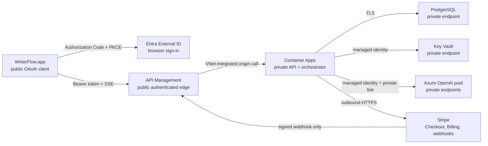
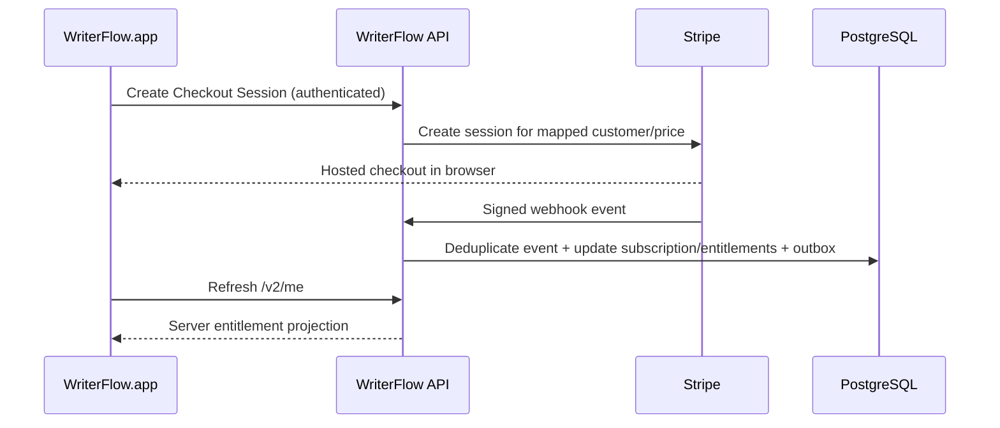
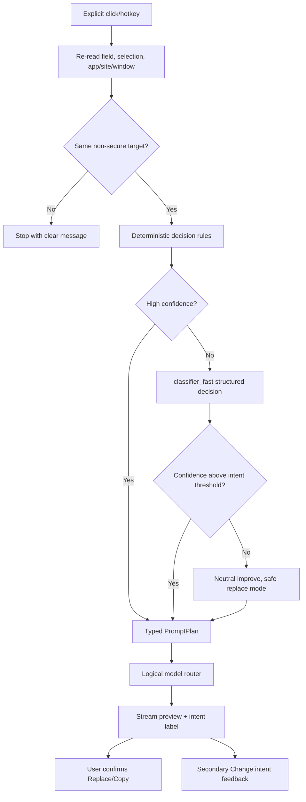

# WriterFlow v2 — Architecture and implementation decisions

**Status:** Proposed implementation baseline  
**Date:** July 17, 2026  
**Applies to:** `PRD-V2.md` and Phase 5 onward

This document answers how WriterFlow v2 should authenticate users, encrypt data,
protect model access, scale inference, support memberships and Stripe, route multiple
Azure models, and replace the action menu with contextual automation.

## 1. Executive recommendation

Build one modular backend before building microservices:

- **Identity:** Microsoft Entra External ID; browser Authorization Code + PKCE from the
  native Mac app, using MSAL's macOS support and `ASWebAuthenticationSession`.
- **Public edge:** Azure API Management Standard v2 at `api.writerflow.app`. Validate
  Entra tokens, apply request/rate limits, and disable response buffering for SSE.
- **Private origin:** one TypeScript/Fastify API-orchestrator in a workload-profiles
  Azure Container Apps environment with an internal virtual IP. The API app uses
  app-level `external` ingress (external to its Container Apps environment), but the
  environment has no public ingress; APIM reaches it through VNet integration and
  private DNS.
- **Model plane:** Azure OpenAI private endpoints, reached from Container Apps with
  managed identity/RBAC. Route by logical capability, not a deployment name supplied by
  the app.
- **Cloud database:** Azure Database for PostgreSQL Flexible Server with private access.
  It is the source of truth for users, organizations, memberships, entitlements,
  subscriptions, idempotency, and the append-only usage ledger.
- **Local database:** keep GRDB, move it to SQLCipher, and keep its random key in macOS
  Keychain. Do not bind local decryption to network login.
- **Sensitive cloud content:** default to no persistence for inference text. If the user
  enables personalization sync, encrypt those fields with per-user data keys wrapped by
  a Key Vault key.
- **Billing:** Stripe Checkout + Billing + Entitlements + Customer Portal. Stripe events
  update a local entitlement projection; Stripe is never called in the inference hot
  path.
- **Intelligence:** one inference capability with `explicit` mode for Phase 5 parity and
  `auto` mode for the v2 interaction. Deterministic routing handles obvious auto cases;
  an efficient classifier handles ambiguity; a typed prompt plan selects a versioned
  prompt and logical model route.

This is intentionally Azure-native because WriterFlow already uses Azure OpenAI. It
minimizes cross-cloud networking and lets the model service, database, origin, and key
management remain on private Azure networking.

## 2. The “private API” boundary

A consumer desktop app cannot call an internet service whose entire ingress is private
unless every user joins a VPN/private network. Hiding a hostname or embedding a shared
client secret does not make the service private; users control the machine and can
extract both.

The implementable goal is:

- one public, documented-to-the-app edge;
- no anonymous inference;
- no public backend origin;
- no public database, key vault, or model endpoint;
- no provider credential or reusable backend credential in the Mac app; and
- defense in depth after the edge token check.



Azure API Management supports JWT validation, VNet access to private backends, and SSE
when `buffer-response="false"`; the Consumption tier is excluded because long-running
SSE is not supported there. Start with Standard v2 and load-test it before GA. Add Azure
Front Door Premium + WAF only when global routing, origin shielding at the gateway, or
specific WAF requirements justify its cost; it can later connect to Azure origins over
Private Link.

## 3. Decision record

| Decision | Choice | Why now | Revisit when |
|---|---|---|---|
| Customer identity | Entra External ID | Azure-native consumer identity, OIDC/OAuth, browser and macOS support, MAU model | Required sign-in UX or provider support is materially weaker than alternatives |
| Native auth flow | Authorization Code + PKCE in system browser | Native apps are public clients; no extractable client secret; follows native OAuth BCP | Do not replace with an embedded web view or custom password flow |
| API gateway | API Management Standard v2 | JWT checks, throttling, private backend access, SSE support | Multi-region/WAF/capacity demands Front Door or Premium tier |
| Compute | Azure Container Apps | Autoscaling container workload, managed identity, internal environment VIP, simpler than AKS | Sustained scale or specialized networking justifies AKS |
| Backend language | TypeScript + Fastify | Strong Stripe/Azure/PostgreSQL ecosystem and fast schema/API iteration | Team expertise or measured runtime limits justify a change |
| Cloud database | PostgreSQL Flexible Server | Transactions and constraints fit membership, Stripe, idempotency, quotas, and ledgers | Not for a document database; add purpose-built stores only for measured needs |
| Local data | GRDB + SQLCipher | Retains reactive queries/search while encrypting the whole file | SPM/packaging spike fails; fallback must be an explicit ADR |
| Cloud content privacy | Ephemeral inference; opt-in encrypted profile sync | Avoids uploading history and minimizes breach impact | Cross-device history becomes a validated user need |
| Provider auth | Managed identity/RBAC | Removes reusable Azure keys from app and backend configuration | Only if a required provider lacks workload identity; then Key Vault secret is server-only |
| Billing | Stripe-hosted Checkout/Portal + webhook projection | No card handling; reliable subscription primitives | Team invoicing or another region requires additional rails |
| Usage pricing | Internal ledger first, Stripe meter later | Costs can be measured before setting prices; billing remains replayable | Never meter from client-reported counts |
| Prompt assets | Version-controlled backend resources | Auditable, testable, protected from client drift | Add an admin authoring surface only with review/version controls |
| Mac signing identity | Stable Developer ID before external alpha | OAuth callbacks, Keychain continuity, and trusted updates must be tested under the real app identity | Final notarization/Sparkle mechanics remain a Phase 8 gate |

The v1 “no custom API” rule is deliberately superseded by this decision. Keep the
reason in the repository so a future security review does not mistake the backend for
accidental scope growth.

## 4. Native app architecture changes

### 4.1 Introduce protocols before swapping transport

`AppDelegate` currently constructs concrete `ActionEngine`, `RecommendationEngine`, and
`AzureOpenAIClient` instances. Create an app dependency container and the following
small interfaces:

```swift
protocol AuthSessionProviding {
    var state: AuthSessionState { get }
    func signIn() async throws
    func accessToken() async throws -> String
    func signOut() async
}

protocol InferenceTransport {
    func stream(_ request: WriterFlowInferenceRequest) -> AsyncThrowingStream<InferenceEvent, Error>
}

protocol StyleAnalysisTransport {
    func analyzeStyle(_ request: StyleAnalysisRequest) async throws -> StyleAnalysisResult
}

protocol EntitlementProviding {
    func refresh() async throws -> AccountSnapshot
}
```

Then:

- `ActionEngine` depends on `InferenceTransport`, not `AzureOpenAIClient`.
- `PersonalizationViewModel` depends on `StyleAnalysisTransport`; the concrete API client
  can implement both small protocols.
- `RecommendationEngine` is replaced by `AutoActionCoordinator` after the transport is
  stable.
- `AzureOpenAIClient` survives only behind a debug/beta `BYOInferenceTransport` during
  migration and is removed from the v2 production build.
- `AzureModelsConfig` and its Settings UI are removed from user-facing v2. The app keeps
  only logical capability labels and server-returned allowance state.

### 4.2 Account-scoped local storage

Current v1 global stores would mix users if account switching were added. Use an
account-scoped directory keyed by a one-way hash of `issuer + subject`, for example:

```text
~/Library/Application Support/WriterFlow/
  global/compatibility.json
  accounts/<account-hash>/writerflow.db
```

Keep device-wide secure-field exclusions and compatibility diagnostics global when they
contain no user text. Keep history, memory, app rules, voice profile, usage cache, and
custom-instruction history account scoped.

Do not use the email address in a path or database key. It is mutable and personally
identifying.

Add a pre-store `LaunchCoordinator`. It reads only content-free global bootstrap state,
then chooses one of these paths before constructing Dashboard/store view models:

1. bound account → open its encrypted store from the locally persisted opaque account
   hash and Keychain DB key, even offline;
2. unbound v1 legacy data → require first identity binding, run migration, then construct
   account stores; or
3. fresh install → bind the first authenticated identity and create its store.

This must replace the current eager chain in which `AppDelegate` creates
`SettingsStore.shared`, whose initializer touches `ConversionEventStore.shared` and
therefore `WriterFlowDatabase.shared`. A migration lock cannot be reliable while those
singletons can open the plaintext database first.

V2.0 supports one bound identity per macOS user profile. Store a global, content-free
“legacy migration consumed by account hash” marker and never remigrate/copy global v1
data. If a different identity signs in, show an account-mismatch screen with only two
choices: sign back into the bound account, or explicitly export/remove local WriterFlow
data and bind the new account. Do not silently switch stores or merge identities.

## 5. Authentication and authorization

### 5.1 Native flow

Use Entra External ID with two app registrations:

1. **WriterFlow macOS public client** — no client secret, registered redirect URI, PKCE.
2. **WriterFlow API resource** — exposes the API audience/scope accepted by the edge.

Implementation sequence:

1. `AuthCoordinator` starts an MSAL interactive sign-in, which uses the system web
   authentication session on macOS.
2. The browser authenticates through an External ID user flow.
3. The authorization code is returned to the app and redeemed with the PKCE verifier.
4. MSAL maintains its token cache in Keychain. WriterFlow never receives a password.
5. The access token is attached to API calls; the client never logs it or places it in a
   query string.
6. The app calls `/v2/bootstrap` with its locally generated opaque install ID. That one
   route provisions user, personal organization, membership, and device idempotently.
7. Subsequent `/v2/me` and capability calls include the returned device ID.
8. Silent refresh runs only when an explicit user action needs the API or when the user
   opens an account surface. Passive typing does not refresh merely to classify text.

Start with email one-time passcode and one social provider. Add more identity providers
through External ID without changing WriterFlow's internal key. Microsoft documents a
short (currently 24-hour) refresh-token lifetime for email OTP sessions; test expiry in
the signed app and treat OTP as fallback if daily interactive authentication makes it a
poor default.

### 5.2 Token validation and authorization layers

For Mac/user routes, APIM uses generic `validate-jwt` against the pinned External ID
customer-tenant OIDC metadata. Do not use `validate-azure-ad-token`: that APIM policy
does not support Microsoft Entra ID for customers. A Mac/user route is rejected unless
all of these are true:

- JWT signature validates against the configured OIDC metadata/JWKS;
- issuer and audience match exactly;
- token is unexpired;
- required scope is present; and
- request size/rate limits pass.

`/v2/webhooks/stripe` is the deliberate exception to bearer-token validation. APIM
applies a strict method/body/rate policy and preserves the raw body; the backend verifies
Stripe's signature before parsing or persisting the event. It never accepts a WriterFlow
user token as webhook authentication.

The application then performs its own authorization:

- resolve `user` by `(issuer, subject)`;
- require `user.status = active`;
- require active organization membership;
- require a registered, non-revoked device record;
- resolve the server-side entitlement projection;
- reserve sufficient quota for the worst permitted route; and
- bind all database work to the resolved organization, never a client-supplied org ID.

API Management's check is defense in depth, not a replacement for application
authorization. `/v2/bootstrap` is the sole user-route exception to the existing-device
requirement: it still requires a valid scoped JWT and strict rate/body limits, creates
the identity/personal organization/membership/device in one idempotent transaction, and
returns the device ID required everywhere else.

### 5.3 Native-client limitations

- A client ID is public and not an authentication secret.
- A device ID header can be copied and is not proof of possession by itself.
- Do not invent a custom request-signing protocol.
- If stronger token binding becomes necessary, adopt a supported standard such as DPoP
  or mTLS only after Entra/MSAL support and certificate/key lifecycle are validated.
- Use Developer ID signing and update integrity to reduce tampered-client distribution,
  but do not treat code signing as the only backend authorization control.
- Establish the stable Developer ID identity before any external Phase 5 alpha that
  migrates local data or stores production auth tokens. Ad-hoc signing is acceptable only
  for local development; final notarization and updater rollout remain later gates.

### 5.4 Session and deletion behavior

- **Sign out:** remove local token cache; retain the encrypted local data/key by default
  so signing back into the same account restores it. Offer “Sign out and remove local
  data” separately.
- **Different identity:** block cloud activation against the bound local profile until
  the user signs into the original account or completes the explicit export/remove/rebind
  flow. Never give the new identity the legacy account's local content.
- **Revoke device:** backend marks the inventory/admission record revoked; the cooperative
  registered installation clears tokens after its next rejected call. A copied bearer
  token/device header is not proof of possession, so identity-session revocation or
  account disable is required for token theft until supported token binding exists.
- **Delete account:** disable inference immediately, cancel scheduled billing according
  to policy, queue live cloud content/wrapped-key deletion, record a deletion tombstone
  that is reapplied after restores until backups expire, and ask separately whether to
  erase the local encrypted store.
- **Offline:** local history/settings remain readable; inference clearly reports that a
  connection/sign-in is required and is never queued for surprise execution.

## 6. API contract

### 6.1 Initial endpoints

| Method | Path | Purpose |
|---|---|---|
| `POST` | `/v2/bootstrap` | JWT-authenticated first-run provisioning of user, personal organization/membership, and current install; only user route not requiring an existing device |
| `GET` | `/v2/me` | User, personal organization, current registered device, privacy, entitlement, and allowance snapshot |
| `DELETE` | `/v2/devices/{id}` | Revoke one device |
| `POST` | `/v2/inference/stream` | One explicit-trigger operation over SSE; `explicit` mode preserves v1 actions in Phase 5 and `auto` mode powers Phase 6 |
| `POST` | `/v2/style/analyze` | Explicit style-analysis operation |
| `GET`/`PUT` | `/v2/personalization/profile` | Optional encrypted profile sync |
| `GET` | `/v2/usage/current` | Current allowance and summarized usage |
| `POST` | `/v2/billing/checkout-session` | Create a short-lived Stripe Checkout URL |
| `POST` | `/v2/billing/portal-session` | Create a short-lived Stripe Portal URL |
| `POST` | `/v2/webhooks/stripe` | Stripe-signed events; no user bearer token |
| `DELETE` | `/v2/account` | Begin account deletion workflow |

Do not build GraphQL. The app has a small command/query surface, while SSE and webhook
semantics are naturally expressed as HTTP endpoints.

### 6.2 Inference request

```http
POST /v2/inference/stream
Authorization: Bearer <access-token>
Content-Type: application/json
Accept: text/event-stream
Idempotency-Key: 019...uuid
X-WriterFlow-Version: 2.0.0
X-WriterFlow-Device: <opaque-device-id>
```

```json
{
  "operationId": "019...uuid",
  "mode": "explicit",
  "task": {
    "requestedAction": "reply",
    "customInstruction": null,
    "promptBuilder": null,
    "outputModeHint": "replace"
  },
  "target": {
    "bundleId": "com.google.Chrome",
    "site": "gmail",
    "windowClass": "email_compose",
    "fieldRevision": "local-opaque-revision"
  },
  "content": {
    "targetScope": "field",
    "draft": "cant make friday",
    "selectedText": null,
    "conversation": "...bounded recent visible thread..."
  },
  "signals": {
    "hasSelection": false,
    "hasVisibleThread": true,
    "inputLength": 16,
    "appTone": "formal"
  },
  "personalization": {
    "profileVersion": 4,
    "inlineEnabledProfile": "...bounded enabled profile..."
  }
}
```

`mode` is a discriminant, not an optional convention:

- **Phase 5 `explicit`:** `requestedAction` is one current `WritingAction`. Custom
  requires `customInstruction`. Prompt Builder carries
  `{phase: analyze|finalize, flowId, brief, answers}`; finalize resubmits the bounded
  brief/context and answers so the server does not need to persist raw session text.
- **Phase 6 `auto`:** no requested action is supplied. The server derives intent,
  output mode, prompt plan, and logical route from the bounded signals.
- `targetScope` is `selection`, `field`, or `empty_reply`. `outputModeHint` is never
  authoritative; the validated server decision determines `replace` or `insert_before`.
- Style analysis remains the separate explicit `/v2/style/analyze` capability because
  its bounded sample array and non-streaming result are a different contract.

Rules:

- The server independently caps every string and rejects unknown fields.
- `site`, `windowClass`, and signals are hints, not authorization claims.
- `fieldRevision` helps correlate client target checks but has no server security role.
- The app sends no full AX tree, keystrokes, clipboard history, or unrelated windows.
- Request content is not written to application logs or the usage database.
- Unknown discriminants/actions/phases/fields are rejected. Custom instructions,
  Prompt Builder answers, and conversation context have independent size limits.

### 6.3 SSE events

```text
event: request.accepted
data: {"requestId":"..."}

event: decision
data: {"intent":"reply","confidence":null,"outputMode":"replace","route":"standard"}

event: output.delta
data: {"delta":"I won’t be able"}

event: usage.summary
data: {"usedUnits":18,"remainingUnits":8240}

event: completed
data: {"requestId":"...","promptVersion":"reply-7"}
```

Canonical order is `request.accepted` → exactly one `decision` → zero or more
`output.delta` events → exactly one `usage.summary` → `completed`. Prompt Builder analyze
may emit one `prompt_builder.questions` event instead of deltas. `error` is terminal at
any point; SSE comments are keepalives, not domain events. Explicit-mode confidence is
`null`; auto mode returns measured confidence and a reason code. Clients ignore unknown
forward-compatible event types but reject invalid ordering, invalid output modes, and
deltas before a decision.

The client sees a logical route such as `standard` or `premium`, never Azure deployment,
resource, region, or provider credentials. Errors use stable codes such as
`AUTH_REQUIRED`, `DEVICE_REVOKED`, `PLAN_REQUIRED`, `QUOTA_EXCEEDED`, `RATE_LIMITED`,
`TARGET_TOO_LARGE`, `MODEL_UNAVAILABLE`, and `REQUEST_CONFLICT`, plus safe display copy.

### 6.4 Idempotency and retries

- Unique constraint: `(user_id, idempotency_key)`.
- Create the request row and quota reservation in one database transaction before model
  work.
- The backend may retry a transient provider failure only before any output was emitted
  and only within the route's attempt budget.
- The Mac must not automatically create a new operation ID after output begins.
- Reusing a completed key returns its final status and does not call a model again. The
  default ephemeral mode does not promise replay of final text; the client retains the
  deltas it received.
- The preview remains incomplete and disables Replace/Copy until `completed`. If the
  stream breaks first, partial deltas are visibly discarded/marked unusable; the Mac
  rechecks the same operation key for status but never silently starts a new one.
- On disconnect, cancel provider work where possible and reconcile any actual provider
  usage/internal cost. A request cancelled or failed before terminal delivery commits
  zero customer billable units even if WriterFlow incurred partial provider cost; keep
  separate anti-abuse/spend accounting for that cost.
- If the backend already reached `completed`, the same key returns completed status but
  cannot replay text under ephemeral mode. Show “result could not be recovered” and
  require an explicit Retry.
- **Retry** is a new operation with `retryOf` pointing at the prior request and is
  separately metered; only its own successful completion consumes customer units.

This avoids storing raw output merely to make automatic replay convenient.

## 7. Data encryption

### 7.1 Local database

The current `writerflow.db`, voice profile, and recent custom instructions are plaintext.
Adopt SQLCipher through GRDB so existing search, observation, and query code still works.

Migration algorithm:

1. Stop all stores and acquire an exclusive migration lock.
2. Verify a backup exists and sufficient free space is available.
3. Generate a random 256-bit database key with Security framework randomness and store
   it as a `kSecAttrAccessibleWhenUnlockedThisDeviceOnly` Keychain item, separate from
   auth tokens.
4. Create a new encrypted database at a temporary path; never attempt to open the
   plaintext file with a passphrase and assume it becomes encrypted.
5. Export/copy all tables in a transaction, migrate voice profile/custom history out of
   UserDefaults, and run SQLCipher integrity checks plus table/row invariants.
6. Atomically swap files. Convert the old plaintext source into a separately encrypted
   rollback archive under a distinct Keychain key, exclude that artifact from diagnostics
   and backup, and delete it at a hard documented deadline. Never retain a plaintext
   rollback database, WAL, or SHM file after successful verification.
7. Remove plaintext UserDefaults values only after the encrypted database reopens and
   verifies.
8. On missing/wrong key, show a locked/recovery state. Remove
   `WriterFlowDatabase.shared`'s current silent in-memory fallback for production data.

A missing `WhenUnlockedThisDeviceOnly` key cannot be recreated from OAuth identity. Recovery is
limited to retrying Keychain access, restoring a deliberately exported database together
with its matching key material if that feature exists, or explicitly resetting the
unreadable local store. Generating a new key never “recovers” old ciphertext; the UI must
state when local-only history will be lost.

GRDB documents SQLCipher support and specifically notes that an existing clear-text
database must be exported to a distinct encrypted database. Its current Swift Package
Manager path requires owning a pinned GRDB package fork/manifest for SQLCipher. The
feasibility gate must assign security-update ownership, prove that SQLCipher is the only
linked SQLite implementation, and test every advertised Release architecture before the
migration is written.

If that spike fails, the fallback is versioned CryptoKit AES-GCM field encryption plus
deliberately designed blind indexes and requires a replacement ADR. That fallback does
not provide whole-file protection: schema, row counts, access patterns, and any
unencrypted indexed metadata remain visible, and arbitrary FTS/search is unavailable.

### 7.2 Cloud database and envelope encryption

Azure PostgreSQL encrypts storage, logs, WAL, and backups at rest. Production should be
created with the chosen customer-managed-key mode from day one because Azure documents
that the mode cannot be changed for that server after creation. CMK increases control
but also creates a Key Vault availability obligation, so configure soft delete,
protection, rotation alerts, and recovery drills before GA.

Platform encryption alone does not protect sensitive columns from an application/database
credential compromise. For cloud-synced personalization:

- generate one random data-encryption key (DEK) per user;
- encrypt content with an authenticated cipher such as AES-256-GCM;
- wrap the DEK with a versioned Key Vault key-encryption key (KEK);
- store only the wrapped DEK, nonce, ciphertext, algorithm, and key version in PostgreSQL;
- let the Container App's managed identity invoke Key Vault unwrap operations; and
- delete the live wrapped DEK and encrypted content during account deletion.

Do not store each user's payload in Key Vault; it is a key/secret service, not a content
database. Do not call this end-to-end encryption: the orchestrator decrypts enabled
profile data to compile an explicit inference request. Because PostgreSQL WAL/PITR
backups contain both ciphertext and wrapped DEKs, live deletion is not immediate
crypto-erasure. Keep deletion tombstones outside the restored database path, reapply
them in a separate least-privilege Azure Storage deletion registry that is not rolled
back with PostgreSQL, reapply them before a restore serves traffic, and disclose that
irreversible deletion completes after the configured backup-retention window expires.

### 7.3 Data retention modes

Keep controls unambiguous:

- **Ephemeral inference (default):** WriterFlow stores no request/output content in the
  cloud; only usage/security metadata persists. Provider retention follows the disclosed
  Azure contract/configuration.
- **Personalization sync (opt-in):** the derived profile/facts/rules are envelope
  encrypted at rest; raw local conversion history remains local.
- **Product improvement consent (separate, future):** never implied by sync and never
  required for paid service.

## 8. PostgreSQL data model

Use one PostgreSQL database per environment and include `organization_id` on every
tenant-owned table. Enable and `FORCE ROW LEVEL SECURITY` as defense in depth. The
runtime role must not own tenant tables and must not have `BYPASSRLS`; set tenant context
transaction-locally, retain explicit tenant predicates, and test pooled connections for
tenant-context leakage.

### 8.1 Identity and tenancy

| Table | Important fields/constraints |
|---|---|
| `users` | `id`, `status`, timestamps; no password hash |
| `auth_identities` | `user_id`, `issuer`, `subject`, encrypted/minimal display claims; unique `(issuer, subject)` |
| `organizations` | `id`, `kind = personal|team`, status, owner metadata |
| `organization_memberships` | `organization_id`, `user_id`, `role`, status; unique pair |
| `devices` | `id`, `user_id`, install public metadata, token timestamps, revoked_at |
| `privacy_preferences` | sync/training/retention choices with version and consent timestamp |

Create a personal organization and owner membership in the same transaction as first
account provisioning.

### 8.2 Entitlement and billing

| Table | Purpose |
|---|---|
| `billing_customers` | WriterFlow org ↔ Stripe customer mapping |
| `subscriptions` | Normalized Stripe subscription snapshot and status |
| `entitlement_grants` | Feature/limit grants from Stripe, trial, support, promo, or admin |
| `entitlement_projection` | Fast current feature/allowance view used by inference |
| `stripe_events` | Webhook inbox keyed by Stripe event ID; encrypted/minimized verified payload or normalized fields, processing status, attempt/error metadata |
| `outbox_events` | Transactional events for async Stripe meters, emails, and reconciliation |

The projection is WriterFlow's authorization source; the underlying Stripe event and
subscription state explain how it was derived.

### 8.3 Inference and usage

| Table | Purpose |
|---|---|
| `inference_requests` | User/org/device, operation key, state, intent, route class, prompt version, timestamps; no text |
| `quota_reservations` | Worst-case units reserved before provider call, expiry, committed/released state |
| `usage_ledger` | Append-only stage entries for classifier/enhancer/generator with provider tokens/cost/billable units |
| `usage_balances` | Transactional current-period projection for fast quota checks |
| `pricing_versions` | Immutable conversion from provider usage/cost to WriterFlow billable units |
| `classifier_feedback` | Explicit chosen/corrected intent and coarse signals; no raw text by default |

Ledger uniqueness should prevent two committed records for the same request stage and
provider attempt. Store provider request IDs when available but do not rely on them as
the only idempotency key.

### 8.4 Personalization

| Table | Purpose |
|---|---|
| `user_data_keys` | Wrapped DEK and KEK version |
| `personalization_profiles` | Encrypted derived style profile, version, source/consent metadata |
| `personalization_rules` | Optional encrypted synced facts/rules, scoped to app/site category |

Do not copy the full v1 `conversions` table to cloud in v2.0.

### 8.5 Why PostgreSQL

WriterFlow's hard problems are relational and transactional:

- one external identity maps to one user;
- a user belongs to organizations with roles;
- subscriptions produce entitlements;
- inference atomically reserves quota and records idempotency;
- Stripe webhooks arrive more than once and out of order;
- append-only usage must reconcile exactly to billing; and
- every query needs a tenant boundary.

PostgreSQL handles these with unique/foreign/check constraints, transactions, indexes,
JSONB for bounded provider metadata, and row-level security. Cosmos DB, Firebase,
MongoDB, or a separate vector database adds consistency work without solving a current
requirement. Add Redis only after measurements show PostgreSQL projections/APIM counters
cannot meet the load; add a vector store only if a defined personalization retrieval
feature needs semantic search.

## 9. Memberships, quotas, and Stripe

### 9.1 Entitlement flow



Checkout success URLs are UX only. They do not grant access. Verify the raw Stripe
signature, persist the event ID before processing, return a quick success, and process
the projection idempotently. Because Stripe retries and does not guarantee that related
events arrive in the desired order, handlers should be state-based and retrieve the
current Stripe object during reconciliation when necessary.

Stripe Entitlements can map products to coarse features. Persist the active entitlement
projection internally, as Stripe itself recommends, but retain WriterFlow-owned quota
numbers and operational limits in WriterFlow configuration so inference never requires
a Stripe round trip.

### 9.2 Usage accounting

For every classifier, enhancer, and generator call:

1. reserve worst-case plan units;
2. record a pending stage;
3. call the selected provider target;
4. reconcile from provider-reported input/output/cached/reasoning usage as supported;
5. compute internal provider cost with an immutable pricing version;
6. compute stable integer billable units;
7. commit the append-only ledger entry and release unused reservation; and
8. emit an outbox event.

The first paid release should use a subscription with included units and a hard cap.
Run metered overage in shadow mode until duplicate rate, late events, refunds, route cost,
and user understanding are measured. Later, send Stripe meter events from committed
ledger rows with the ledger UUID as the meter event identifier. Never send a meter event
directly from the inference handler or from Mac-reported token counts.

### 9.3 Pricing layers

Do not tie a plan to a specific model slug. Define entitlements such as:

```text
auto_write
standard_route
premium_route
prompt_enhancer
personalization_sync
context_chars_limit
monthly_units
concurrent_requests
priority_service
```

This lets Azure deployments change without changing product promises. A recommended
launch sequence is Free + Pro subscription first, Team schema without Team UI, then
explicit metered overage and Team/Business after the individual ledger is proven.

## 10. Multi-model Azure gateway

### 10.1 Logical route catalog

The Mac sends `auto_write`; the server chooses from logical routes:

| Route | Use | Design target |
|---|---|---|
| `classifier_fast` | Ambiguous intent/output-mode classification | Structured JSON, smallest adequate model, low latency |
| `grammar_fast` | Strict correction | Low cost/latency, deterministic prompt |
| `rewrite_standard` | Most tone/elaborate/reply work | Default quality/cost balance |
| `rewrite_premium` | Complex/long/high-quality retry | Higher capability; Pro entitlement |
| `prompt_enhancer` | Send-ready prompts in LLM/coding destinations | Constraint retention and structure |
| `style_analyzer` | Explicit style-profile proposal | Batch/non-streaming, user triggered |

Each logical route has an ordered target pool:

```yaml
route: rewrite_standard
targets:
  - resource: writerflow-aoai-uksouth
    deployment: <server-side-name>
    region: uksouth
    priority: 1
  - resource: writerflow-aoai-westeurope
    deployment: <server-side-name>
    region: westeurope
    priority: 2
policy:
  timeout_ms: 15000
  max_attempts_before_first_delta: 2
  circuit_breaker: true
```

Store this non-secret mapping in Azure App Configuration or versioned deployment config;
store credentials nowhere because managed identity is preferred. Log only the logical
route and an internal target ID.

### 10.2 Router order

1. Validate entitlement and input/context size.
2. Apply deterministic intent rules.
3. If ambiguous, call `classifier_fast` and record its usage.
4. Select standard/premium route from intent, complexity, quality retry, allowance,
   health, and latency budget.
5. Compile the versioned prompt plan.
6. Call the healthiest allowed target.
7. Retry/fail over only before the first emitted delta.
8. Reconcile every attempt and return a safe failure if no target qualifies.

Current OpenAI guidance recommends the newest model family by capability/price tier and
the Responses API for modern workflows, but Azure deployment availability can lag or
differ. Therefore, do not hard-code the current OpenAI model name in the Mac contract or
promise it in a plan. Provision Azure-supported models, run WriterFlow's eval set, and
change the server route only after quality/latency/cost gates pass.

### 10.3 Private provider access

- Disable Azure OpenAI public network access.
- Create private endpoints and private DNS for each resource.
- Give the Container App's managed identity the minimum Azure OpenAI inference role.
- Keep deployment configuration server-side.
- Set hard Azure budgets/alerts and per-resource quotas in addition to WriterFlow limits.
- Never forward arbitrary URLs, model names, tools, or system prompts from the client.

## 11. Contextual auto selection

### 11.1 Why the current classifier cannot auto-run unchanged

V1's `RecommendationEngine` only highlights one action after the popover opens. It:

- makes a separate heavy-model request;
- sees bundle-level tone but not the resolved site/window title;
- returns no confidence or reason;
- has no custom/prompt-enhancer intent;
- treats structural “visible conversation” as a coarse Boolean; and
- matches a recommendation target by PID + bundle + role, which can confuse two fields
  with the same role.

Before removing the options flow, add a stronger target identity and a labeled eval set.

### 11.2 Decision pipeline



Suggested deterministic rules, validated by evals rather than assumed correct:

- empty/very short draft + visible message thread + compose surface → reply;
- selected text with obvious strict errors and no generative instruction → grammar;
- LLM/coding chat destination + imperative rough request → prompt enhancement;
- explicit user instruction captured through a custom-input gesture → custom transform;
- app/site rule with strong user preference may set tone but should not override an
  explicit draft instruction;
- everything else → ambiguous classifier or neutral improve.

Do not cloud-classify on every pause. The click/hotkey authorizes the entire operation.
Normal click or `⌃⌥ Space` starts auto mode. Shift-click or `⌃⌥⇧ Space` enters the
existing non-activating Custom composer directly and sends nothing until the user submits
the instruction; this keeps free-text control without retaining the options list or
wasting an auto call.

### 11.3 Personalized classifier

Learn only coarse preferences at first:

- preferred intent by app/site category;
- intent correction counts;
- accepted output length/tone band;
- explicit always/never rules; and
- recency-weighted confidence.

Keep raw examples local. Send the enabled derived preference vector with an explicit
operation, or sync its encrypted representation when the user enables sync. Never let a
learned preference bypass hard context evidence, secure-field guards, or the preview.

## 12. Prompt enhancement

“Prompt Enhancer” in v2 is distinct from v1's two-pass visible “Prompt Builder” action.
It is a routing/prompt capability, not a mandatory extra model request.

### 12.1 Trust and injection boundary

Prompt compilation treats inputs by trust class rather than concatenating one string:

1. reviewed server policy and typed task rules;
2. server-resolved intent/output/route constraints;
3. the user's explicit Custom/Prompt Builder instruction, allowed to shape text but not
   authorization, retention, tools, model targets, or system policy;
4. enabled personalization, scoped only to style/content preferences; and
5. field text and conversation context as quoted untrusted data that may contain hostile
   instructions and must never become control text.

Use separate provider message/content parts and explicit delimiters, prohibit tool calls
and arbitrary URL/model/template selection, and validate classifier, Prompt Builder,
output-mode, and insert/replace results against closed schemas/enums. Model output never
executes SQL, changes entitlements, selects an unrestricted route, or bypasses the local
preview/refocus guard. Maintain injection fixtures for instructions hidden in email/chat
context, profile fields, custom text, and model output.

### 12.2 Prompt assets

Move the current 400+ lines of inline `Prompts.swift` strings to backend resources:

```text
prompts/
  manifest.yaml
  common/system.md
  intents/reply.md
  intents/grammar.md
  intents/rewrite.md
  intents/prompt-enhancer.md
  schemas/decision.json
  evals/cases.jsonl
```

Each deployed request records `prompt_version`, intent, logical route, and eval release.
Templates are reviewed in Git and deployed with the API. They are not editable through
the Mac app and do not live in PostgreSQL at first.

### 12.3 Typed plan

```ts
type PromptPlan = {
  intent: "reply" | "grammar" | "tone" | "elaborate" | "custom" | "prompt_enhance" | "improve";
  outputMode: "replace" | "insert_before";
  tone: "formal" | "casual" | "neutral" | null;
  appCategory: "email" | "personal_message" | "work_message" | "llm_chat" | "code" | "other";
  constraints: string[];
  includeConversation: boolean;
  personalizationVersion: number | null;
  route: string;
  promptVersion: string;
};
```

For common actions, this plan compiles directly to a provider request. For a prompt
destination, the prompt-enhancer model's output is the final WriterFlow preview; do not
then call another rewrite model. Use a separate enhancer+generator chain only for
complex custom operations where an A/B eval proves a meaningful improvement.

## 13. Stripe implementation details

- All secret-key Stripe SDK use is backend-only.
- The app asks the backend for Checkout/Portal URLs and opens them with the system
  browser.
- Map one personal organization to one Stripe customer.
- Store Stripe IDs, not card data.
- Verify webhook signatures against the raw body before JSON parsing.
- In one short transaction insert the unique Stripe event ID plus the minimum encrypted
  verified payload/normalized object identifiers needed for replay. Return `2xx` only
  after the durable inbox write, then process projection work asynchronously.
- Minimize/encrypt webhook PII, set a retention deadline, and never put raw payloads in
  logs or traces.
- Handle at minimum subscription created/updated/deleted, invoice paid/payment failed,
  Checkout completed, and active-entitlement-summary changes.
- Do not use email as the billing-to-login join key.
- Reconcile subscriptions/entitlements on a schedule and after suspicious webhook gaps.
  Reconciliation reads canonical current Stripe objects rather than assuming event
  arrival order.
- Create meter events from committed `usage_ledger` rows with stable identifiers; Stripe
  documents identifier uniqueness for retry protection, but WriterFlow must still keep
  its own permanent dedupe state.
- Use the hosted Customer Portal rather than building card/subscription management UI.

## 14. Service layout and deployment

Recommended repository additions:

```text
WriterFlow/
  Sources/WriterFlow/                 # existing native app
  services/
    api/                               # Fastify HTTP/SSE API + orchestration
    worker/                            # outbox, Stripe, reconciliation jobs
    shared/                            # schemas, auth claims, ledger types
  infra/
    bicep/                             # dev/staging/prod Azure resources
    apim/                              # JWT, limits, SSE policies
  prompts/                             # versioned model-facing resources/evals
  docs/runbooks/                       # rotation, restore, incident, deletion
```

Start with one deployable API and a worker process from the same codebase. Keep modules
separate but do not split them into independently operated services until scale or team
ownership requires it.

### 14.1 Scaling baseline

- Keep the API stateless after each streamed request; PostgreSQL owns idempotency,
  reservations, entitlements, and ledger state. Do not require sticky sessions.
- Scale Container Apps on concurrent HTTP/SSE requests plus CPU, with a bounded stream
  duration and at least two warm production replicas before paid GA. Load-test the real
  APIM-to-origin connection path before choosing thresholds or gateway units.
- Bound database connections per replica and size the total pool below PostgreSQL's
  connection budget. Add pooling, Redis, Service Bus, or a second region only in response
  to measured saturation or recovery requirements.
- Process the PostgreSQL transactional outbox with a separately scaled worker using
  lease/`SKIP LOCKED` semantics. Run periodic reconciliation as a scheduled Container
  Apps Job so Stripe/provider cleanup does not share the inference request lifecycle.
- Apply per-user and per-organization concurrency/quota limits in PostgreSQL/application
  transactions; APIM rate limits provide burst protection but are not the billing or
  authorization source of truth.
- Make route health and kill switches shared server configuration so a bad Azure target
  can be drained without restarting the app or requiring a Mac update.

Required environments:

- **dev:** synthetic users/data, smallest resources, public developer conveniences only
  where documented;
- **staging:** production-equivalent networking/auth, Stripe sandbox, scrubbed test data;
- **prod:** separate subscription/resource group/tenant configuration, private endpoints,
  production Stripe, CMK/recovery monitoring, least privilege.

Use Bicep for reproducible infrastructure. CI runs unit/integration/eval/migration tests,
secret scanning, dependency review, IaC validation, image scanning, and a release
artifact scan before deployment.

## 15. Wispr Flow research: evidence versus inference

The user request says “Whisperflow”; this document assumes the intended comparison is
[Wispr Flow](https://wisprflow.ai/). Its proprietary backend is not public, so WriterFlow
must not present a guessed implementation as fact.

### 15.1 Publicly documented

Wispr publicly describes:

- browser-completed desktop sign-in with Apple, Google, Microsoft, enterprise SSO, and
  email/password options;
- delegated identity, organization roles, SAML/OIDC and SCIM for enterprise plans;
- TLS in transit, encrypted cloud storage/KMS/HSM controls, managed secrets, a WAF/edge
  layer, and cloud-hosted multi-tenant processing;
- a mix of open-source models and proprietary LLM providers without publicly naming the
  exact providers or infrastructure;
- TLS-encrypted, outbound-initiated egress to subprocessors for service delivery;
- separate privacy/training and cloud-sync controls, and an explicit statement that the
  service is not end-to-end encrypted because inference requires decryption;
- server-enforced zero-data-retention behavior that covers the processing pipeline rather
  than relying only on a client preference flag;
- context awareness that identifies the app/browser site and applies Personal Messaging,
  Email, Work Messaging, or Other behavior automatically;
- deployed correction-learning/dictionary and **Prompt Engineer** transform features;
- a separately described research direction toward device-resident personalization and
  local policies; and
- Basic, Pro, Team, and Enterprise plans, with Stripe handling web payment processing.

### 15.2 Reasonable inference, not confirmed architecture

Those statements are consistent with—but do not prove—this pattern:

```text
native client
  → authenticated public edge/WAF
  → session + entitlement + abuse checks
  → private request orchestrator
  → Wispr-operated/internal model path or outbound managed-model provider
  → streamed result
```

They also make a server-owned entitlement projection, provider router, retention policy,
and usage ledger plausible. There is no reliable public evidence for Wispr's exact cloud
provider, database, container platform, queue, auth vendor, model provider, protocol, or
Stripe schema. Do not claim it uses Azure, PostgreSQL, Kubernetes, Auth0, Clerk, Redis,
or any particular LLM.

### 15.3 Patterns worth adapting

- Browser sign-in that returns cleanly to the native app.
- An authenticated edge with private inference/provider access behind it.
- App/site context categories that drive automatic behavior.
- Server-side entitlements and a hosted billing provider.
- Minimal local personalization features sent only with the active operation.
- Separate controls for model-training consent, cloud sync, and inference retention.
- Derive and enforce retention policy on the server; do not trust a client flag as the
  only control.
- No claim of end-to-end encryption when the backend must decrypt for model processing.

WriterFlow should not copy Wispr's product prices or infer its private components. The
architecture above is recommended because it fits WriterFlow's current Azure/native
constraints and public security patterns, not because Wispr is known to use it.

## 16. Current-code migration map

| Current component | V2 treatment |
|---|---|
| `App/AppDelegate.swift` | Add dependency container, auth/session gate, account-scoped stores |
| `Engine/AzureOpenAIClient.swift` | Replace in production with `WriterFlowAPIClient`; keep beta debug adapter temporarily |
| `Engine/ActionEngine.swift` | Depend on `InferenceTransport`; consume decision + text SSE events |
| `Engine/RecommendationEngine.swift` | Replace with `AutoActionCoordinator` after transport baseline |
| `Engine/PromptBuilder.swift` / `Prompts.swift` | Move policy/templates server-side; keep minimal client request shaping |
| `Engine/MemoryPromptBuilder.swift` | Produce bounded request-time profile or encrypted sync payload |
| `Overlay/ActionPopoverView.swift` | Remove from normal path in Phase 6; keep preview correction escape hatch |
| `Overlay/OverlayController.swift` | Trigger auto operation directly; strengthen target identity/refocus guard |
| `Store/WriterFlowDatabase.swift` | Account scope + SQLCipher + explicit locked/recovery state |
| `Store/SettingsStore.swift` | Move user content from UserDefaults into encrypted DB |
| `Store/KeychainStore.swift` | Separate auth-token cache, local DB key, and temporary legacy BYO key |
| `Store/AzureModelsConfig.swift` | Remove from production UI/client routing; server logical routes replace it |
| `Dashboard/SettingsTabView.swift` | Replace endpoint/key/deployment cards with Account, Privacy, Plan, Devices |
| `Dashboard/UsageView.swift` | Show server allowance/billable units plus local acceptance analytics |
| `Store/ConversionEventStore.swift` | Keep encrypted local history; add request/intent/prompt-version metadata |

Fix two v1 issues before using event data for personalization or billing:

1. `OverlayController.applyPreview` currently marks acceptance before checking whether
   text replacement succeeded. Record acceptance only after a successful Replace or
   explicit Copy.
2. Strengthen field identity so recommendations/results cannot be applied to a different
   same-role field in the same process.

## 17. Security verification checklist

- Threat model covers token theft, client tampering, replay, prompt injection, quota
  races, cross-tenant access, Stripe replay/order, provider failover, and key loss.
- Public artifact scan finds no Azure/Stripe/database/Key Vault secrets or private host
  configuration.
- Public-network access is disabled for Container Apps origin, PostgreSQL, Key Vault, and
  Azure OpenAI in staging/prod.
- APIM generic `validate-jwt` pins the External ID issuer/audience/scope and rate limits
  Mac routes by validated subject, never an untrusted organization header; application
  authorization owns organization limits. The Stripe route uses raw-body signature
  verification instead of JWT.
- Application authorization repeats user/device/membership/entitlement checks.
- PostgreSQL RLS and explicit tenant filters pass cross-tenant negative tests.
- SSE request/response-body logging and caching are disabled at gateway/telemetry layers.
- Content is absent from logs, traces, crash reports, usage ledger, and analytics.
- SQLCipher migration is interruption-safe and does not silently produce an empty store.
- Key rotation, database restore with deletion-tombstone replay, Stripe replay, account
  deletion, and backup-expiry deletion have tested runbooks.
- Hard provider and WriterFlow spend ceilings are active before paid/public inference.

## 18. Primary references

### Native authentication

- [IETF RFC 8252 — OAuth 2.0 for Native Apps](https://datatracker.ietf.org/doc/html/rfc8252)
- [Apple — ASWebAuthenticationSession](https://developer.apple.com/documentation/authenticationservices/aswebauthenticationsession)
- [Microsoft — MSAL redirect URIs for iOS and macOS](https://learn.microsoft.com/en-us/entra/msal/objc/redirect-uris-ios)
- [Microsoft — MSAL Keychain configuration](https://learn.microsoft.com/en-us/entra/msal/objc/howto-v2-keychain-objc)
- [Microsoft — refresh-token lifetimes and email OTP behavior](https://learn.microsoft.com/en-us/entra/identity-platform/refresh-tokens)
- [Microsoft — Entra External ID pricing model](https://learn.microsoft.com/en-ie/entra/external-id/external-identities-pricing)
- [Microsoft — External ID issuer and metadata validation](https://learn.microsoft.com/en-us/troubleshoot/entra/entra-id/app-integration/troubleshooting-signature-validation-errors)

### Azure private backend and model access

- [Microsoft — secure Azure OpenAI app with Container Apps and managed identity](https://learn.microsoft.com/en-us/azure/developer/ai/get-started-securing-your-ai-app)
- [Microsoft — managed identities in Azure Container Apps](https://learn.microsoft.com/en-us/azure/container-apps/managed-identity)
- [Microsoft — APIM authentication and authorization](https://learn.microsoft.com/en-us/azure/api-management/authentication-authorization-overview)
- [Microsoft — APIM JWT validation](https://learn.microsoft.com/en-us/azure/api-management/validate-jwt-policy)
- [Microsoft — External ID limitation of `validate-azure-ad-token`](https://learn.microsoft.com/en-us/azure/api-management/validate-azure-ad-token-policy)
- [Microsoft — APIM virtual-network options](https://learn.microsoft.com/en-us/azure/api-management/virtual-network-concepts)
- [Microsoft — APIM outbound VNet integration](https://learn.microsoft.com/en-us/azure/api-management/integrate-vnet-outbound)
- [Microsoft — APIM Server-Sent Events configuration](https://learn.microsoft.com/en-us/azure/api-management/how-to-server-sent-events)
- [Microsoft — APIM LLM token limits](https://learn.microsoft.com/en-us/azure/api-management/llm-token-limit-policy)
- [Microsoft — Front Door Premium origin Private Link](https://learn.microsoft.com/en-us/azure/frontdoor/private-link)
- [Microsoft — Container Apps networking](https://learn.microsoft.com/en-us/azure/container-apps/networking)
- [Microsoft — Container Apps ingress](https://learn.microsoft.com/en-us/azure/container-apps/ingress-overview)

### Data and key protection

- [Microsoft — Azure PostgreSQL encryption](https://learn.microsoft.com/en-us/azure/postgresql/security/security-data-encryption)
- [Microsoft — Azure PostgreSQL private endpoints](https://learn.microsoft.com/en-us/azure/postgresql/network/how-to-networking-servers-deployed-public-access-add-private-endpoint)
- [Microsoft — Azure PostgreSQL backup retention](https://learn.microsoft.com/en-us/azure/postgresql/backup-restore/concepts-backup-restore)
- [Microsoft — Key Vault and secrets best practices](https://learn.microsoft.com/en-us/azure/security/fundamentals/secrets-best-practices)
- [GRDB — SQLCipher encryption and clear-text export](https://github.com/groue/GRDB.swift#encryption)
- [PostgreSQL — row security policies](https://www.postgresql.org/docs/current/ddl-rowsecurity.html)

### Stripe

- [Stripe — usage-based billing model](https://docs.stripe.com/billing/subscriptions/usage-based/how-it-works)
- [Stripe — Billing Entitlements](https://docs.stripe.com/billing/entitlements)
- [Stripe — Customer Portal integration](https://docs.stripe.com/customer-management/integrate-customer-portal)
- [Stripe — webhook handling and verification](https://docs.stripe.com/webhooks)
- [Stripe — billing meter-event identifiers](https://docs.stripe.com/api/billing/meter_event/create)

### Model API and streaming

- [OpenAI — current model-selection guidance](https://developers.openai.com/api/docs/guides/latest-model)
- [OpenAI — streaming Responses API events](https://developers.openai.com/api/docs/guides/streaming-responses)

### Wispr Flow public evidence

- [Wispr Flow — setup guide](https://docs.wisprflow.ai/articles/3152211871-setup-guide)
- [Wispr Flow — security and compliance FAQ](https://docs.wisprflow.ai/articles/3467817258-security-and-compliance-faq)
- [Wispr Flow — data controls](https://wisprflow.ai/data-controls)
- [Wispr Flow — context awareness](https://docs.wisprflow.ai/articles/4678293671-feature-context-awareness)
- [Wispr Flow — plans](https://docs.wisprflow.ai/articles/9559327591-flow-plans-and-what-s-included)
- [Wispr Flow — Pro, Team, and Enterprise FAQ](https://docs.wisprflow.ai/articles/2458545840-faqs-for-flow-pro-team-and-flow-enterprise-plans)
- [Wispr Flow — transforms](https://docs.wisprflow.ai/articles/8068950331-how-to-use-transforms-beta)
- [Wispr Flow — dictionary learning](https://docs.wisprflow.ai/articles/4052411709-teach-flow-your-words-with-the-dictionary)
- [Wispr Flow — SCIM provisioning](https://docs.wisprflow.ai/articles/6159095582-set-up-scim-user-provisioning-in-wispr-flow)
- [Wispr Flow — technical challenges](https://wisprflow.ai/post/technical-challenges)
- [Wispr Flow — privacy policy](https://wisprflow.ai/privacy-policy)
