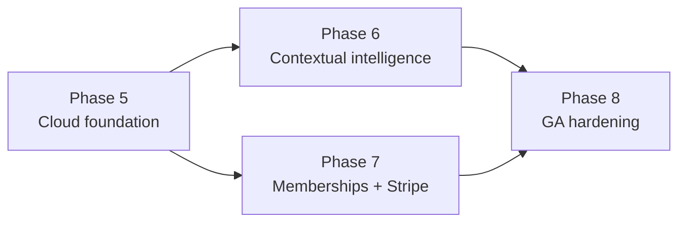

# WriterFlow v2 — Implementation roadmap

**Status:** Planned  
**Baseline:** v1.0.0 published July 17, 2026  
**Product requirements:** [`PRD-V2.md`](PRD-V2.md)  
**Architecture:** [`V2-ARCHITECTURE.md`](V2-ARCHITECTURE.md)

V2 should be delivered as four gated phases. Phase 5 changes the transport and trust
boundary without changing the normal v1 action UX. Phase 6 changes the intelligence and
removes the options step. Phase 7 turns measured usage into membership and billing.
Phase 8 hardens and releases the combined system.



## Delivery principles

1. Preserve the v1 explicit-action privacy boundary in every phase.
2. Change one risk plane at a time: transport first, then UX/classification, then money.
3. Keep the existing local AX extraction, overlay, preview, and text-replacement pipeline.
4. Put provider credentials, deployment names, routing, prompts, quotas, and entitlements
   behind the backend.
5. Meter from the first backend call, but do not charge until the ledger reconciles.
6. Keep raw conversion history local by default.
7. Never run BYO and WriterFlow-funded inference in parallel for the same operation.
8. Do not remove the options flow until the labeled classifier eval and correction path
   pass their release thresholds.

## Phase 5 — Cloud foundation and secure transport (next)

**Goal:** A signed-in v2 alpha user can perform every existing v1 action through one
authenticated WriterFlow SSE API, while Azure OpenAI, PostgreSQL, Key Vault, and the API
origin remain private. Existing local data is encrypted and preserved.

Detailed checklist: [`phases/phase-5-v2-cloud-foundation.md`](phases/phase-5-v2-cloud-foundation.md)

### Ordered stages

| Stage | Deliverable | Depends on | Relative size |
|---|---|---|---|
| 5.0 | ADRs, data inventory, threat model, API/event schemas, environments | v1 baseline | M |
| 5.1 | TypeScript API/worker skeleton, PostgreSQL migrations, Bicep, CI | 5.0 | L |
| 5.2 | Web-side Entra sign-in, device pairing + WriterFlow device tokens, `/v2/device/*`, users/orgs/devices, `/v2/me` | 5.1 | L |
| 5.3 | SQLCipher store, pre-store launch coordination, UserDefaults content migration, account scoping/recovery | 5.0 for feasibility; 5.2 for identity-bound migration | L |
| 5.4 | Minimum idempotency/reservation/ledger plus APIM → private Container Apps → private Azure OpenAI streaming parity | 5.1, 5.2 | XL |
| 5.5 | Harden accounting/concurrency/reconciliation and add logical multi-model route pools | 5.4 | L |
| 5.6 | Native transport abstraction, v1 action parity, migration alpha and rollback | 5.2–5.5 | XL |

### Phase 5 exit

- Release build has no direct Azure inference path or shared provider credential.
- All v1 actions pass through the authenticated backend and stream correctly.
- Provider/database/origin public access is disabled in staging.
- Local data is encrypted with tested v1 migration and recovery.
- Every provider stage is represented exactly once in the server usage ledger.
- No action UX has yet been removed; transport parity is proven independently.

## Phase 6 — Contextual intelligence and prompt quality

**Goal:** Clicking the icon or pressing the hotkey directly produces the contextually
correct result; the pre-generation options menu is no longer the normal flow.

### Stage 6.1 — Target identity and labeled evaluation set

- Add window/site/element/frame/content-revision identity to `FocusedField` and require a
  re-read before generation and Replace.
- Build a minimum 300-case redacted/synthetic eval spanning Gmail, Outlook, Slack,
  WhatsApp, Notes, LinkedIn, ChatGPT, Claude, Cursor, Notion, and generic text fields.
- Label intended action, acceptable fallback, tone, output mode, context requirement, and
  destructive-risk class.
- Add regression cases for empty reply fields, same-role fields, stale focus, secure
  fields, terminal line scoping, and insert-versus-replace output.

**Accept:** current recommendation behavior and new approaches can be scored from the
same deterministic harness without sending real user history.

### Stage 6.2 — Deterministic context signals

- Create `ContextSignalBuilder` in the Mac app and a matching versioned API schema.
- Resolve app/site/window category, selection state, thread presence, LLM-chat/code
  destination, input shape, explicit custom instruction, and app rule.
- Apply versioned deterministic intent rules in the backend after the explicit trigger;
  the Mac supplies bounded context signals but does not make an unaudited second routing
  policy. Do not perform passive network classification.
- Return `neutral improve` for uncertain destructive/output-mode decisions.

**Accept:** high-confidence rules cover a measured portion of the eval set with at least
95% acceptable-route precision.

### Stage 6.3 — Structured classifier and model router

- Add the server `classifier_fast` route and strict structured decision schema.
- Return intent, tone, output mode, context need, complexity, confidence, and reason code.
- Set per-intent thresholds from eval results, not a single arbitrary threshold.
- Add target health, timeout, circuit breaker, region fallback, and entitlement-aware
  standard/premium routing.
- Meter classifier calls and skip them when deterministic rules decide safely.

**Accept:** combined exact-intent accuracy ≥85%, acceptable-route accuracy ≥95%, and
ambiguous first-delta p95 <2.5 s on the defined test regions.

### Stage 6.4 — Versioned prompt plans and enhancer

- Refactor Phase 5's behavior-equivalent server prompt port into typed reviewed
  `PromptPlan` resources/evals, then remove the remaining production client fallback;
  Phase 6 changes quality/routing, not the original transport ownership.
- Implement the typed `PromptPlan`, prompt manifest, prompt version telemetry, and eval
  runner.
- Keep grammar/tone/reply prompt assembly deterministic.
- Use `prompt_enhancer` as the final route for LLM/coding destinations.
- A/B an extra enhancer stage for complex custom instructions; ship it only if measured
  quality gain justifies cost/latency.

**Accept:** no prompt-policy change deploys without the regression eval; every inference
records a prompt version and logical route without logging prompt content.

### Stage 6.5 — Remove normal options flow

- Clicking icon/hotkey starts `AutoActionCoordinator` directly.
- Preview shows the chosen intent label and a secondary “Change intent” correction.
- Keep Replace/Copy/Retry/Discard and the existing non-activating focus guarantees.
- Make Shift-click on the icon and collision-checked `⌃⌥⇧ Space` open the existing
  non-activating Custom composer directly. It sends no auto request before submission;
  the default options list is not shown.
- Record successful Replace only after the text write succeeds.

**Accept:** end-to-end keyboard flow is type → hotkey → streamed preview → Enter, with no
pre-generation action choice and no wrong-field replacement in the target-app matrix.

### Stage 6.6 — Personalized classifier

- Derive app/site intent preferences from successful accepted actions and explicit
  corrections.
- Keep raw examples encrypted/local; sync only an opt-in encrypted derived profile.
- Add edit/reset/disable controls and confidence decay.
- Re-run global and per-app eval slices to prevent personalization from overriding hard
  safety/context evidence.

**Accept:** personalization reduces intent corrections on a dogfood cohort without
reducing global acceptable-route accuracy or creating passive uploads.

## Phase 7 — Memberships, usage pricing, and Stripe

**Goal:** Free and Pro access is server-authoritative and self-service. The system can
support teams and metered overage later without rebuilding identity or the ledger.

### Stage 7.1 — Entitlement and allowance engine

- Define feature/limit keys independent of model names.
- Project grants from trial, plan, support/promo, and admin sources.
- Enforce monthly units, context limits, route access, concurrency, and hard spend caps.
- Define grace behavior for transient billing/event delays.

**Accept:** changing an entitlement affects the next request without an app update or
Stripe call in the request path.

### Stage 7.2 — Stripe subscription foundation

- Backend-only Stripe Customer, Product/Price mapping, Checkout Session, and Customer
  Portal Session.
- Signed raw-body webhook endpoint with event inbox, dedupe, retry-safe processing,
  outbox, and scheduled reconciliation.
- Persist the unique event plus sufficient encrypted/minimized verified data before
  returning `2xx`; process asynchronously, retain no webhook PII in logs, and reconcile
  against canonical current Stripe state rather than arrival order.
- Stripe Entitlements map products to coarse features; WriterFlow persists the active
  projection for fast authorization.

**Accept:** test-mode upgrade, renewal, payment failure, downgrade, cancellation, and
  reactivation produce the correct WriterFlow entitlement after duplicate and reordered
  webhook tests.

### Stage 7.3 — Free and Pro product surfaces

- Replace Azure endpoint/key/deployment Settings with Account, Plan, Usage, Devices, and
  Privacy cards.
- Show included/remaining WriterFlow units and reset date; keep local acceptance/usage
  analytics clearly separate.
- Add upgrade and manage-billing browser flows.
- Do not expose provider tokens, raw costs, or deployment configuration as customer
  pricing.

**Accept:** a user can understand current access, upgrade, manage billing, and recover
from a failed payment without support intervention.

### Stage 7.4 — Personalization sync (optional v2 GA candidate)

- Per-user envelope key and encrypted derived profile/rules.
- Explicit sync toggle, last-sync state, conflict policy, export, live deletion, restore
  tombstones, and disclosed backup-expiry behavior.
- Never sync raw history by default and never conflate sync with product-training consent.

**Accept:** two Macs signed into the same user converge on enabled profile/rules; disabling
sync prevents future cloud writes; deletion removes live wrapped keys/content; and a
backup restore cannot resurrect a tombstoned user before final backup expiry.

### Stage 7.5 — Metered overage readiness

- Run billable-unit computation and Stripe meter outbox in shadow mode.
- Reconcile ledger totals, provider invoices, plan revenue, retries, refunds, and failed
  requests for at least one full billing cycle.
- Add explicit opt-in, price disclosure, hard spend cap, usage alerts, and support/refund
  policy before charging overage.

**Accept:** 100% ledger-to-meter identifier reconciliation with no duplicates. Charging
remains off until the commercial decision is approved.

## Phase 8 — Security, reliability, migration, and v2 release

**Goal:** Release the combined account-backed, encrypted, contextual product with an
operable service and honest privacy/billing disclosures.

### Stage 8.1 — Security and privacy gate

- Independent threat-model review and remediation.
- Cross-tenant/RLS authorization tests; replay and quota-race tests.
- Secret/artifact/IaC/container/dependency scans.
- Verify private networking and managed identity in production.
- Privacy policy, subprocessor list, retention, data export/deletion, and incident
  response runbooks.
- Key rotation, CMK outage/recovery, database restore with deletion-tombstone replay, and
  backup-expiry deletion drills.
- Keep the opaque deletion registry outside PostgreSQL's restore domain (separate
  least-privilege Azure Storage) and block restored service traffic until replay passes.

### Stage 8.2 — Reliability and cost gate

- Load test SSE through APIM with response buffering/body logging disabled.
- Validate autoscale, connection limits, provider failover, circuit breaker, and region
  behavior.
- 8-hour and multi-day Mac soak plus service soak.
- Alerting for auth failures, provider saturation, ledger mismatch, Stripe lag, cost
  anomalies, and availability without logging user text.
- Prove provider and account hard spend ceilings.

### Stage 8.3 — v1 migration and staged rollout

- Forced-interruption and rollback test for SQLCipher migration.
- Upgrade matrix from a real v1.0.0 database with history/memory/rules and BYO key.
- Cohorts: internal → private alpha → opt-in beta → default v2 → GA.
- Kill switches independently control new transport, auto selection, premium route, sync,
  and paid entitlement enforcement.
- Remove v1 BYO production transport and user API-key UI before GA after rollback evidence
  is complete.

### Stage 8.4 — Distribution release gate

- Ship the v1 ad-hoc distribution model for v2 (ADR-0010): ARM64 ad-hoc-signed app in a
  DMG + SHA-256 + documented manual Gatekeeper approval + manual updates. No Apple
  Developer account, notarization, stapling, or Sparkle auto-update.
- Prominently disclose install/update Gatekeeper friction in onboarding and on the
  install page, since v2 is a paid product.
- Validate device pairing (deep link + manual `user_code` fallback) and Keychain
  token continuity across ad-hoc update and app relocation; verify re-pair-on-loss.
- Publish v2 release notes, supported architecture, privacy/security changes, pricing,
  migration behavior, and rollback/support procedure.

## Critical dependencies

```text
Entra/API identity ─┬─> authenticated inference ─> native transport parity ─> auto UX
                    └─> users/orgs/devices ───────> entitlements ───────────> Stripe

usage ledger ─────────────────────────────────────> pricing shadow ─────────> overage

Entra immutable identity ─> pre-store account binding ─> SQLCipher migration ─> optional cloud sync

labeled eval + target identity ──────────────────> classifier ─────────────> remove options
```

Work that can safely run in parallel:

- The SQLCipher build/packaging spike can run alongside backend/IaC after account-scope
  decisions are frozen; runtime binding/migration waits for Phase 5.2 identity.
- Classifier eval data can be prepared while transport parity is being built, but the
  no-options UI must wait for Phase 5.
- Stripe sandbox schema/webhook tests can begin after the usage/entitlement schema is
  stable, but paid enforcement waits for transport and ledger parity.

## First implementation slice

The smallest meaningful vertical slice is not “build all auth” or “build all backend.”
It is:

1. one External ID test user signs in on the web and approves a debug Mac build;
2. `/v2/device/approve` provisions the user/personal organization/membership/device in
   one idempotent transaction, `/v2/device/token` returns a WriterFlow device token, and
   `/v2/me` returns that current device;
3. the app sends one existing Fix Grammar action with an idempotency key;
4. APIM validates the WriterFlow token and relays SSE to a private Container App;
5. Container Apps uses managed identity to one private Azure OpenAI deployment;
6. PostgreSQL records request status and one usage-ledger stage without text; and
7. the existing preview/Replace flow completes.

Once this slice works, add the other v1 actions through the same transport. Do not begin
Stripe or remove the options flow before this path is measured and reliable.

## Definition of done for every v2 stage

1. Acceptance criteria in the relevant phase document pass.
2. Unit, integration, migration, contract, and security-negative tests cover the change.
3. No inference content or credential appears in logs/traces/artifacts.
4. Tenant/user/device scope is explicit for every new persisted record.
5. Every provider attempt belongs to one idempotent WriterFlow operation and is uniquely
   metered.
6. Explicit-action-only networking and secure-field inertness are unchanged.
7. Focus never leaves the user's text field during overlay interactions.
8. A rollback or kill-switch path is documented for any remotely enabled behavior.
9. Operational dashboards and alerts exist before a dependency becomes a production gate.
10. The relevant PRD, architecture, phase checklist, privacy copy, and runbook are updated
    in the same stage.
